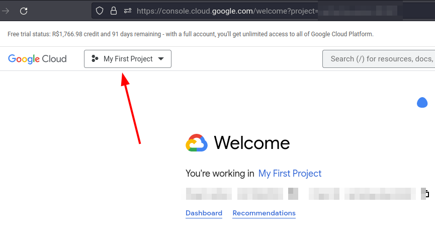

# Getting Started

Terminal Translator is a translation CLI that uses the [Google Cloud API](https://cloud.google.com/translate).

## Installation

Installation is very simple, just run the following command in the terminal:

```bash
pip install terminal-translator
```

!!! tip "We recommend trying [pipx](https://github.com/pypa/pipx)"
    pipx is a tool to help you install and run end-user applications written in Python.

    ```pipx install terminal-translator```


## Configuration

To start using the CLI, first we need to configure the access credentials for the goole API.

Login to the [Google Cloud API](https://cloud.google.com/translate), and click start free.


!!! notes "A credit card will be required but don't worry, there will be no charge."

Go to the google cloud console home page and create a new project




Give the project any name


Select the project, and save the project-id


Search for Cloud Translation API and enable it


Create an access credential
!!! warning "Be aware of the usage quota limit"
    Don't share your credentials


Give the service account any name


Go back to the API page and select your service account, and create a new Json type key

A json file containing your credentials will be downloaded


Go back to your service accounts and copy the respective email


In the IAM session, grant access to this email and assing the role Cloud Translation API Admin


Now with the configured service credentials we can go to the CLI


Use the `tt-configure` command passing two arguments, first the project-id followed by the path of the credentials Json file.

```bash
tt-configure <project-id> <google-api-credentials>
```


Finished! Now you are ready to use the Terminal Translator CLI

See the [tutorial session](/tutorial) to learn about the basic usage
