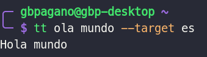
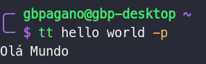
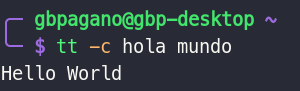

# Tutorial

The CLI consists of two commands, `tt` and `tt-configure`.

## tt

`tt` is the main CLI command.

**Usage**

Basically we call the command passing the text to be translated

By default the text will be translated to `en-us`

```bash
tt ola mundo
```


We can also inform the target language for the translation

```bash
tt ola mundo --target es  # spanish
```


There is also a parameter to translate directly into Portuguese

```bash
tt hello world -p
```



In addition there is a parameter to copy the output directly to the clipboard

```bash
tt -c hola mundo
```


For more information use the parameter `--help`

```bash
tt --help
```


## tt-configure

`tt-configure` is only for the initial configuration of the Google Cloud API credentials, as seen in the [settings section](/#configuration).

**Usage**

Basically we call the command passing two arguments, first the project-id followed by the path of the credentials Json file.

```bash
tt-configure <project-id> <google-api-credentials>
```

For quick help use the `--help` argument.


```bash
tt-configure --help
```


